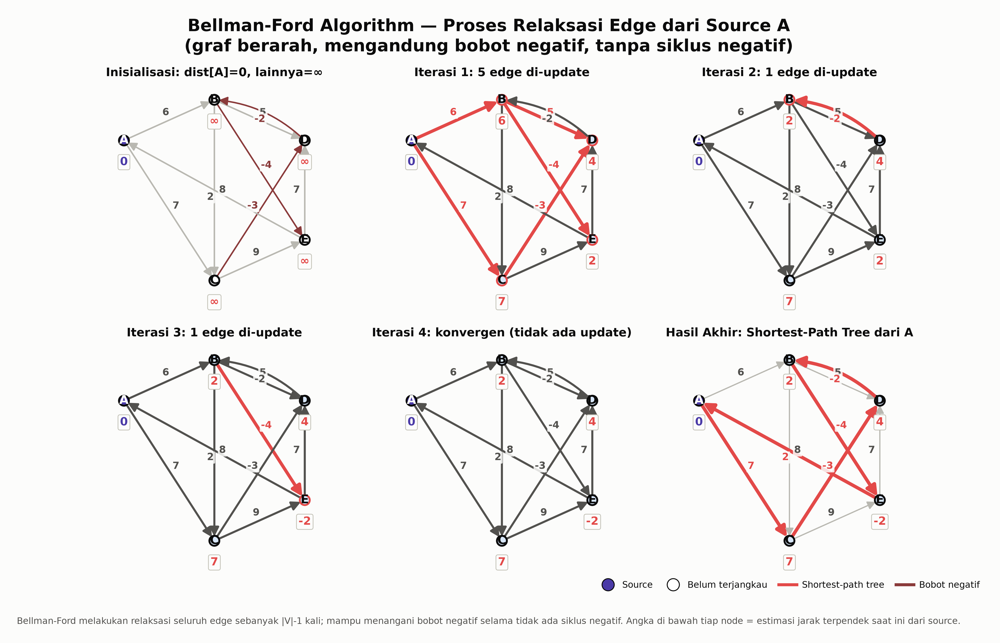
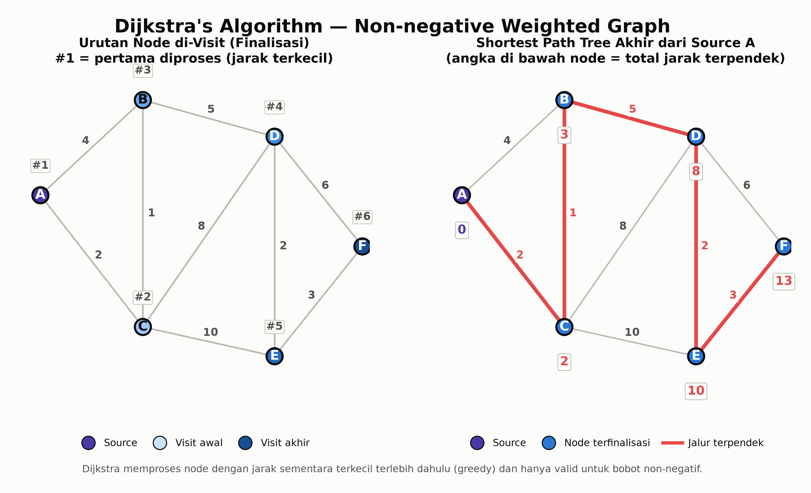
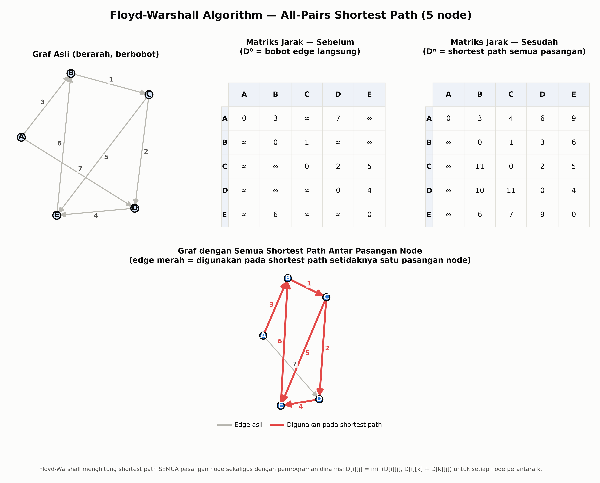
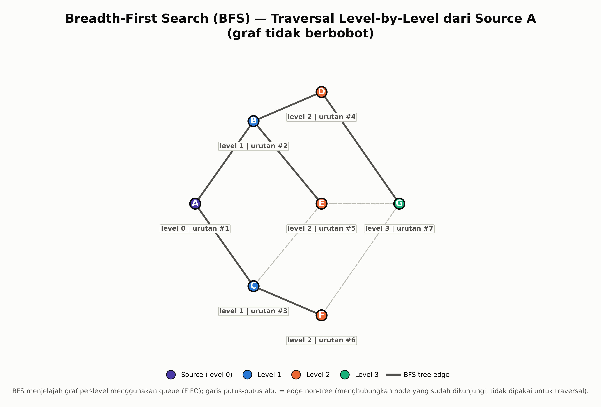
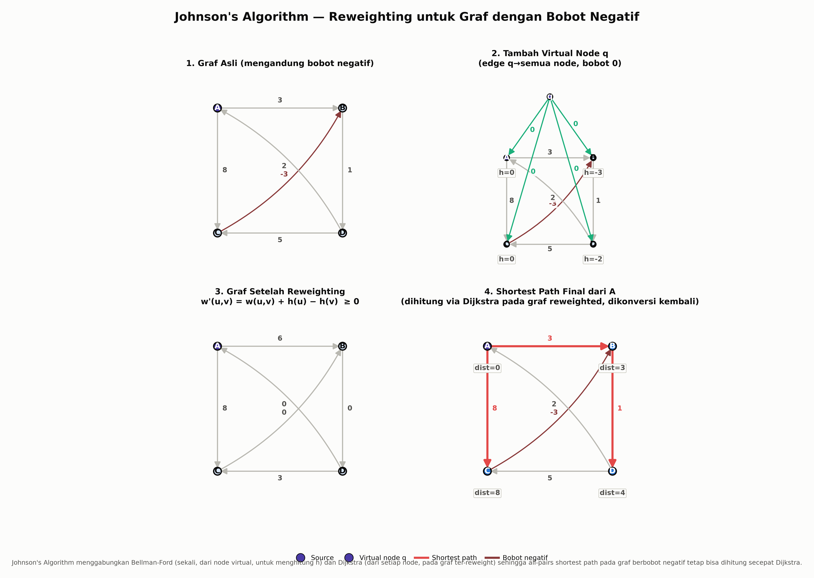
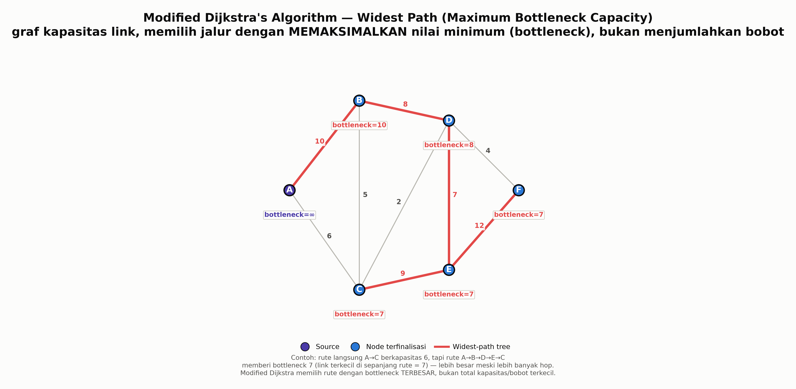
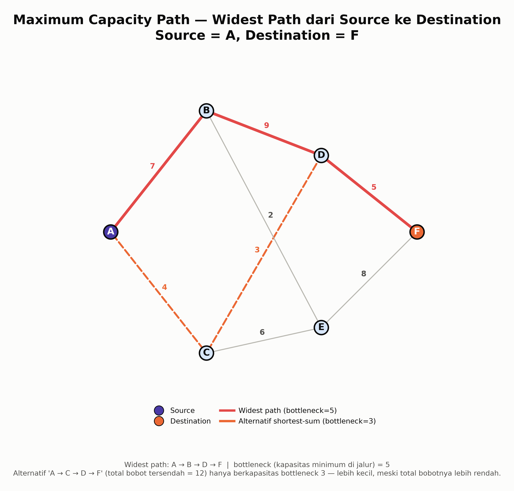
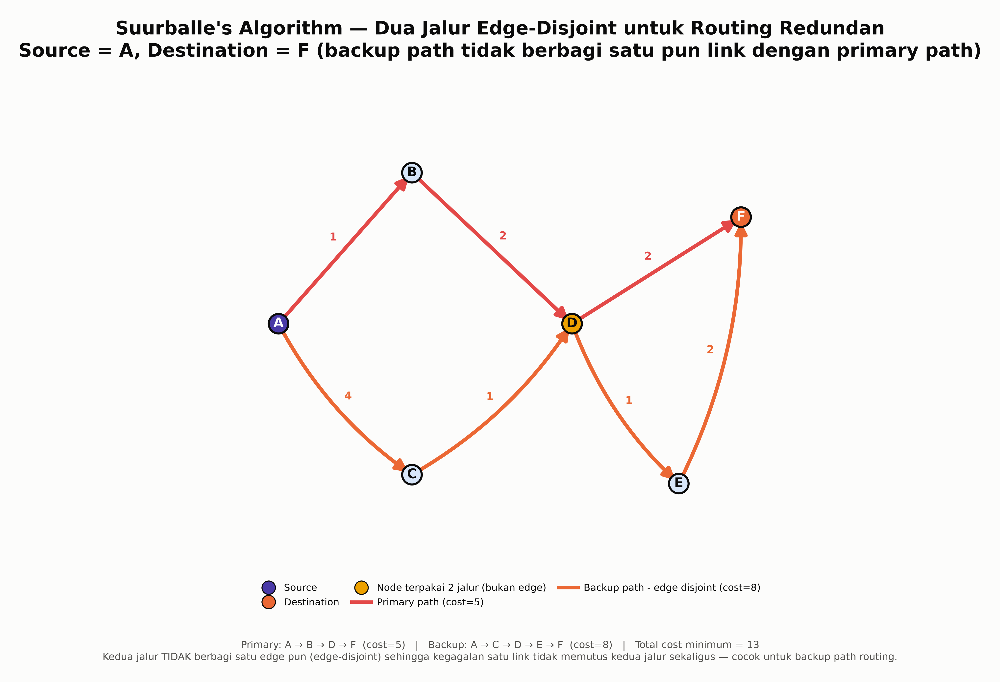

<h1 align="center">Visualisasi Algoritma Shortest Path & Widest Path</h1>

<p align="center">
  
  
  
  
</p>

Repository ini berisi script Python (`generate_diagrams.py`) yang menghasilkan **8 diagram visualisasi** untuk materi presentasi mata kuliah **Jaringan Telekomunikasi**, topik *"Shortest Path and Widest Path Algorithms"*. Setiap diagram dibuat dari implementasi algoritma yang sebenarnya (bukan ilustrasi manual), sehingga seluruh angka, urutan proses, dan jalur yang ditampilkan **konsisten dengan hasil komputasi** — cocok dijadikan bahan slide, laporan, maupun modul belajar.

## Daftar Isi

- [Preview](#preview)
- [Perbedaan Shortest Path vs Widest Path](#perbedaan-shortest-path-vs-widest-path)
- [Cara Menggunakan](#cara-menggunakan)
  - [Requirement](#requirement)
  - [Instalasi](#instalasi)
  - [Menjalankan Script](#menjalankan-script)
  - [Output](#output)
  - [Kustomisasi](#kustomisasi)
- [Penjelasan Algoritma](#penjelasan-algoritma)
  - Grup 1 — Shortest Path
    - [Bellman-Ford Algorithm](#bellman-ford-algorithm)
    - [Dijkstra's Algorithm](#dijkstras-algorithm)
    - [Floyd-Warshall Algorithm](#floyd-warshall-algorithm)
    - [Breadth-First Search (BFS)](#breadth-first-search-bfs)
    - [Johnson's Algorithm](#johnsons-algorithm)
  - Grup 2 — Widest Path
    - [Modified Dijkstra's Algorithm](#modified-dijkstras-algorithm)
    - [Maximum Capacity Path](#maximum-capacity-path)
    - [Suurballe's Algorithm](#suurballes-algorithm)
- [Struktur Project](#struktur-project)
- [Lisensi](#lisensi)
- [Kontributor & Catatan](#kontributor--catatan)

## Preview

<table align="center">
  <tr>
    <td align="center"><br><b>1. Bellman-Ford Algorithm</b></td>
    <td align="center"><br><b>2. Dijkstra's Algorithm</b></td>
  </tr>
  <tr>
    <td align="center"><br><b>3. Floyd-Warshall Algorithm</b></td>
    <td align="center"><br><b>4. Breadth-First Search (BFS)</b></td>
  </tr>
  <tr>
    <td align="center"><br><b>5. Johnson's Algorithm</b></td>
    <td align="center"><br><b>6. Modified Dijkstra's Algorithm</b></td>
  </tr>
  <tr>
    <td align="center"><br><b>7. Maximum Capacity Path</b></td>
    <td align="center"><br><b>8. Suurballe's Algorithm</b></td>
  </tr>
</table>

<p align="center"><em>Semua gambar disimpan dalam resolusi <strong>300 dpi</strong>, background putih, siap ditempel langsung ke slide PowerPoint.</em></p>

## Perbedaan Shortest Path vs Widest Path

Kedua grup algoritma di repo ini menjawab pertanyaan yang **berbeda secara fundamental**, meski sama-sama mencari "jalur terbaik" antar node dalam sebuah graf jaringan:

| Aspek | Shortest Path | Widest Path |
|---|---|---|
| Tujuan | Meminimalkan **total** bobot sepanjang jalur | Memaksimalkan **nilai minimum (bottleneck)** di sepanjang jalur |
| Operasi agregasi | **Penjumlahan** (`+`) bobot tiap edge | **Minimum** (`min`) dari bobot tiap edge |
| Interpretasi bobot | Umumnya *cost*, delay, jarak, atau metric routing | Umumnya *kapasitas/bandwidth* link |
| Contoh penerapan | Routing protocol (OSPF, RIP) untuk menentukan rute dengan latency/cost terendah | Menentukan rute dengan **bandwidth terjamin terbesar**, atau backup path redundan |
| Analogi | "Rute tercepat dari titik A ke B" | "Rute dengan pipa air terbesar dari A ke B (dibatasi oleh pipa tersempit di sepanjang rute)" |

Contoh konkret: jalur langsung dengan kapasitas 6 Mbps bisa jadi **lebih buruk** dibanding jalur memutar 3-hop yang masing-masing linknya berkapasitas ≥7 Mbps — walau jalur memutar itu "lebih jauh". Shortest path algorithm akan mengejar total cost terendah, sedangkan widest path algorithm akan mengejar bottleneck (link terlemah) terbesar. Lihat [06_modified_dijkstra.png](06_modified_dijkstra.png) dan [07_maximum_capacity_path.png](07_maximum_capacity_path.png) untuk ilustrasi langsungnya.

## Cara Menggunakan

### Requirement

- Python **3.9+** (dikembangkan & diuji dengan Python 3.14)
- Library pihak ketiga:
  - [`matplotlib`](https://matplotlib.org/) — rendering diagram/grafik
  - [`networkx`](https://networkx.org/) — representasi graf & algoritma pendukung (mis. `min_cost_flow` untuk Suurballe's Algorithm)
- Modul standar Python yang dipakai (sudah termasuk dalam instalasi Python): `math`, `heapq`, `copy`, `os` — tidak perlu diinstal terpisah.

### Instalasi

Semua dependency tercantum di [`requirements.txt`](requirements.txt):

```txt
matplotlib>=3.8
networkx>=3.2
```

### Clone Repository

```bash
git clone https://github.com/<username>/<nama-repo>.git
cd <nama-repo>
```

Install dependency (disarankan pakai virtual environment):

```bash
python -m venv .venv
source .venv/bin/activate        # Linux/Mac
.venv\Scripts\activate           # Windows (PowerShell/cmd)

pip install -r requirements.txt
```

### Menjalankan Script

```bash
python generate_diagrams.py
```

Script akan mencetak progres di terminal setiap file berhasil dibuat:

```text
Generating diagrams for 'Shortest Path and Widest Path Algorithms'...
  -> saved 01_bellman_ford.png
  -> saved 02_dijkstra.png
  -> saved 03_floyd_warshall.png
  -> saved 04_bfs.png
  -> saved 05_johnson.png
  -> saved 06_modified_dijkstra.png
  -> saved 07_maximum_capacity_path.png
  -> saved 08_suurballe.png

Selesai! Semua 8 diagram berhasil dibuat di: <path-project>
```

### Output

| File | Algoritma |
|---|---|
| `01_bellman_ford.png` | Bellman-Ford Algorithm |
| `02_dijkstra.png` | Dijkstra's Algorithm |
| `03_floyd_warshall.png` | Floyd-Warshall Algorithm |
| `04_bfs.png` | Breadth-First Search (BFS) |
| `05_johnson.png` | Johnson's Algorithm |
| `06_modified_dijkstra.png` | Modified Dijkstra's Algorithm (Widest Path) |
| `07_maximum_capacity_path.png` | Maximum Capacity Path |
| `08_suurballe.png` | Suurballe's Algorithm |

Semua file disimpan **langsung di root folder project** (folder yang sama dengan `generate_diagrams.py`), dengan resolusi 300 dpi dan background putih (`#fcfcfb`).

### Kustomisasi

Setiap diagram punya fungsi generator sendiri (mis. `draw_bellman_ford()`, `draw_dijkstra()`, dst.) di bagian bawah `generate_diagrams.py`. Untuk mengganti graf/node/bobot dengan data sendiri, cukup edit variabel `nodes`, `edges`, dan `pos` (posisi tata letak node) di dalam fungsi terkait. Contoh untuk Dijkstra:

```python
def draw_dijkstra():
    nodes = ["A", "B", "C", "D", "E", "F"]          # ganti label node di sini
    edges = [
        ("A", "B", 4), ("A", "C", 2), ("B", "C", 1),  # (node1, node2, bobot)
        ("B", "D", 5), ("C", "D", 8), ("C", "E", 10),
        ("D", "E", 2), ("D", "F", 6), ("E", "F", 3),
    ]
    source = "A"                                      # ganti node sumber
    pos = {                                            # posisi (x, y) tiap node, atur agar tidak tumpang tindih
        "A": (-1.05, 0.35), "B": (-0.35, 1.0), ...
    }
    ...
```

Catatan saat mengganti graf:
- Untuk **Bellman-Ford** dan **Johnson's Algorithm**, pastikan graf tetap **tidak memiliki siklus negatif** (negative cycle) — script memakai `assert` untuk memvalidasi ini, jadi eksekusi akan berhenti dengan error jika graf tidak valid.
- Untuk **Dijkstra** dan **BFS**, bobot harus **non-negatif** (Dijkstra secara matematis tidak valid untuk bobot negatif).
- Untuk **Modified Dijkstra**, **Maximum Capacity Path**, dan **Suurballe's Algorithm**, "bobot" edge merepresentasikan **kapasitas/cost**, bukan jarak — sesuaikan skenario sesuai kebutuhan (bandwidth link, dsb).
- Setelah mengubah graf, cukup jalankan ulang `python generate_diagrams.py` — seluruh 8 file akan di-generate ulang (menimpa file lama).

## Penjelasan Algoritma

### Grup 1 — Shortest Path Algorithms

#### Bellman-Ford Algorithm

**Definisi singkat**: Algoritma pencarian shortest path single-source pada graf berarah berbobot yang mampu menangani bobot **negatif**, selama tidak ada siklus negatif (negative cycle) yang terjangkau dari source.

**Kegunaan di jaringan telekomunikasi**: Menjadi dasar protokol routing distance-vector seperti **RIP (Routing Information Protocol)**; juga relevan ketika metric routing bisa merepresentasikan "insentif" (nilai negatif) selain cost murni, mis. traffic engineering dengan penalti/bonus pada link tertentu.

**Kompleksitas waktu**: `O(V × E)` — melakukan relaksasi seluruh edge sebanyak `|V| - 1` kali.

**Cara kerja singkat**:
- Inisialisasi jarak semua node = ∞, kecuali source = 0.
- Ulangi sebanyak `|V| - 1` kali: untuk setiap edge `(u, v, w)`, jika `dist[u] + w < dist[v]`, update `dist[v]`.
- Jika setelah `|V| - 1` iterasi masih ada edge yang bisa direlaksasi → terdeteksi siklus negatif.
- Berhenti lebih awal (early stop) jika satu iterasi penuh tidak menghasilkan perubahan (konvergen).

**Diagram**: [`01_bellman_ford.png`](01_bellman_ford.png) — menunjukkan proses relaksasi edge iterasi-demi-iterasi dari node sumber A, termasuk edge berbobot negatif, hingga terbentuk shortest-path tree final.

#### Dijkstra's Algorithm

**Definisi singkat**: Algoritma greedy untuk mencari shortest path single-source pada graf berbobot **non-negatif**, memproses node dengan estimasi jarak terkecil terlebih dahulu.

**Kegunaan di jaringan telekomunikasi**: Basis dari protokol routing link-state seperti **OSPF (Open Shortest Path First)** dan **IS-IS**, di mana setiap router menghitung shortest path tree ke seluruh router lain berdasarkan cost link yang selalu non-negatif.

**Kompleksitas waktu**: `O((V + E) log V)` menggunakan min-priority queue (binary heap); `O(V²)` pada implementasi sederhana tanpa heap.

**Cara kerja singkat**:
- Inisialisasi jarak source = 0, node lain = ∞; masukkan ke priority queue.
- Ambil node dengan jarak sementara terkecil, tandai sebagai final (visited).
- Relaksasi seluruh tetangga node tersebut; update jarak jika ditemukan rute lebih pendek.
- Ulangi hingga semua node terproses (finalized).

**Diagram**: [`02_dijkstra.png`](02_dijkstra.png) — panel kiri menunjukkan urutan node di-visit (nomor #1–#6), panel kanan menunjukkan shortest-path tree final dengan jalur di-highlight merah.

#### Floyd-Warshall Algorithm

**Definisi singkat**: Algoritma dynamic programming untuk menghitung shortest path **semua pasangan node sekaligus** (all-pairs shortest path) dalam satu graf berarah berbobot.

**Kegunaan di jaringan telekomunikasi**: Cocok untuk precompute **tabel routing lengkap** pada jaringan berskala kecil–menengah (mis. topologi backbone tetap), atau untuk analisis topologi jaringan (menghitung diameter jaringan, jarak antar seluruh pasangan node sekaligus).

**Kompleksitas waktu**: `O(V³)` — tiga loop bersarang atas seluruh node sebagai perantara (`k`), sumber (`i`), dan tujuan (`j`).

**Cara kerja singkat**:
- Inisialisasi matriks jarak `D` dari bobot edge langsung; `D[i][i] = 0`, pasangan tanpa edge = ∞.
- Untuk setiap node perantara `k`, untuk setiap pasangan `(i, j)`: jika `D[i][k] + D[k][j] < D[i][j]`, update `D[i][j] = D[i][k] + D[k][j]`.
- Setelah `k` mencakup seluruh node, `D` berisi shortest path final untuk **semua** pasangan node.

**Diagram**: [`03_floyd_warshall.png`](03_floyd_warshall.png) — menampilkan graf asli, matriks jarak sebelum (D⁰) dan sesudah (Dⁿ), serta graf dengan seluruh edge yang terpakai pada shortest path antar pasangan node mana pun.

#### Breadth-First Search (BFS)

**Definisi singkat**: Algoritma traversal graf **tidak berbobot** yang menjelajah node level-demi-level menggunakan struktur queue (FIFO), sekaligus menghasilkan shortest path (dalam satuan jumlah hop) dari source.

**Kegunaan di jaringan telekomunikasi**: Dipakai untuk kasus **hop-count routing** (semua link dianggap berbobot sama), analisis broadcast/flooding pada jaringan, serta penentuan radius/jangkauan jaringan dari satu node.

**Kompleksitas waktu**: `O(V + E)`.

**Cara kerja singkat**:
- Mulai dari source, masukkan ke queue dengan level 0.
- Keluarkan node dari queue, kunjungi seluruh tetangga yang belum dikunjungi, beri level = level_node_sekarang + 1, masukkan ke queue.
- Ulangi hingga queue kosong — seluruh node yang reachable akan memiliki level (= jarak hop minimum dari source).

**Diagram**: [`04_bfs.png`](04_bfs.png) — setiap level traversal diberi warna berbeda, edge BFS tree ditampilkan solid, edge non-tree ditampilkan putus-putus.

#### Johnson's Algorithm

**Definisi singkat**: Algoritma all-pairs shortest path yang menggabungkan **Bellman-Ford** (sekali, dari node virtual) dan **Dijkstra** (dari setiap node), sehingga tetap efisien pada graf **sparse** meski mengandung bobot negatif (tanpa siklus negatif).

**Kegunaan di jaringan telekomunikasi**: Alternatif Floyd-Warshall yang lebih efisien untuk jaringan besar namun jarang terhubung penuh (sparse topology), ketika beberapa link memiliki metric negatif (mis. skema insentif routing) namun tetap dibutuhkan solusi all-pairs.

**Kompleksitas waktu**: `O(V² log V + V·E)` — satu kali Bellman-Ford `O(V·E)` ditambah Dijkstra dari tiap node `O(V·(V+E) log V)`. Jauh lebih cepat dibanding Floyd-Warshall `O(V³)` pada graf sparse.

**Cara kerja singkat**:
1. Tambahkan node virtual `q` dengan edge berbobot 0 menuju semua node lain.
2. Jalankan Bellman-Ford dari `q` untuk mendapatkan nilai `h(v)` (shortest distance dari `q`).
3. **Reweight** setiap edge asli: `w'(u, v) = w(u, v) + h(u) − h(v)` — hasilnya dijamin ≥ 0.
4. Jalankan Dijkstra dari setiap node pada graf yang sudah di-reweight.
5. Konversi kembali jarak sebenarnya: `dist(u, v) = dist'(u, v) − h(u) + h(v)`.

**Diagram**: [`05_johnson.png`](05_johnson.png) — 4 panel berurutan: graf asli dengan bobot negatif → penambahan node virtual q → graf hasil reweighting (semua bobot ≥ 0) → shortest path final.

### Grup 2 — Widest Path Algorithms

#### Modified Dijkstra's Algorithm

**Definisi singkat**: Variasi Dijkstra yang, alih-alih menjumlahkan bobot sepanjang jalur, **memaksimalkan nilai minimum (bottleneck)** dari seluruh edge yang dilalui — dikenal juga sebagai *widest path* atau *maximum bottleneck path* algorithm.

**Kegunaan di jaringan telekomunikasi**: Routing dengan **jaminan bandwidth** (bandwidth-guaranteed routing) — mis. memilih rute untuk trafik yang butuh throughput minimum tertentu, di mana bobot edge merepresentasikan kapasitas link yang tersedia.

**Kompleksitas waktu**: `O((V + E) log V)` menggunakan max-priority queue — struktur identik dengan Dijkstra, hanya fungsi relaksasi yang berbeda.

**Cara kerja singkat**:
- Inisialisasi bottleneck source = ∞, node lain = −∞.
- Ambil node dengan nilai bottleneck sementara **terbesar** dari priority queue, tandai final.
- Untuk tiap tetangga, hitung `candidate = min(bottleneck[u], w(u, v))`.
- Jika `candidate > bottleneck[v]`, update `bottleneck[v] = candidate`.
- Ulangi hingga seluruh node terproses.

**Diagram**: [`06_modified_dijkstra.png`](06_modified_dijkstra.png) — menampilkan widest-path tree dari source ke seluruh node beserta nilai bottleneck di tiap node, dengan contoh konkret perbandingan terhadap rute langsung yang total-nya lebih pendek tapi bottleneck-nya lebih kecil.

#### Maximum Capacity Path

**Definisi singkat**: Penerapan widest path algorithm untuk **satu pasangan** source–destination spesifik — mencari satu rute dengan kapasitas bottleneck terbesar di antara semua kemungkinan rute.

**Kegunaan di jaringan telekomunikasi**: Pemilihan rute optimal untuk transfer data besar/real-time (mis. video streaming, transfer file) yang membutuhkan **throughput maksimum**, bukan sekadar latency terendah.

**Kompleksitas waktu**: `O((V + E) log V)` — sama seperti Modified Dijkstra, karena secara algoritmik keduanya identik (hanya berbeda fokus: seluruh node vs satu destination).

**Cara kerja singkat**:
- Sama seperti Modified Dijkstra's Algorithm, namun proses cukup dihentikan begitu node destination difinalisasi.
- Jalur ditelusuri mundur (backtrack) dari destination ke source menggunakan predecessor yang tercatat selama relaksasi.
- Bandingkan terhadap rute "tercepat berdasarkan total bobot" (shortest-by-sum) untuk menunjukkan bahwa kedua kriteria bisa menghasilkan rute yang **berbeda**.

**Diagram**: [`07_maximum_capacity_path.png`](07_maximum_capacity_path.png) — jalur widest path (merah, solid) dibandingkan langsung dengan alternatif shortest-by-sum (oranye, putus-putus) dari source ke destination yang sama.

#### Suurballe's Algorithm

**Definisi singkat**: Algoritma untuk mencari **dua jalur edge-disjoint** (tidak berbagi satu edge pun) dari source ke destination dengan **total cost minimum** — dipakai untuk merancang jalur primary dan backup yang saling independen.

**Kegunaan di jaringan telekomunikasi**: Desain **routing redundan/protection path** — mis. MPLS Fast Reroute, proteksi jalur pada jaringan optik (SONET/SDH ring), atau redundansi fiber — memastikan kegagalan satu link tidak memutus primary path **dan** backup path secara bersamaan.

**Kompleksitas waktu**: `O((V + E) log V)` — setara dua kali proses Dijkstra ditambah proses transformasi graf (reduced cost + reversal), atau ekuivalen dengan sekali proses **min-cost flow** 2 unit dari source ke destination.

**Cara kerja singkat**:
1. Jalankan Dijkstra dari source, dapatkan shortest path pertama (`P1`) dan jarak `d(v)` ke seluruh node.
2. Ubah bobot setiap edge menjadi *reduced cost*: `w'(u, v) = w(u, v) − d(v) + d(u)` (bernilai 0 di sepanjang `P1`, ≥ 0 di edge lain).
3. **Balik arah** (reverse) setiap edge yang termasuk `P1` dengan bobot 0.
4. Jalankan Dijkstra sekali lagi pada graf yang telah dimodifikasi untuk mendapatkan jalur kedua (`P2`).
5. Gabungkan `P1` dan `P2`: edge yang saling berlawanan arah (dipakai `P1` maju, `P2` mundur) saling meniadakan (interference cancellation), sisanya membentuk **dua jalur edge-disjoint** dengan total cost minimum.

> Catatan implementasi: pada `generate_diagrams.py`, hasil dua jalur edge-disjoint dihitung melalui formulasi **min-cost flow** (`networkx.min_cost_flow`, 2 unit flow source→destination, kapasitas 1 per edge) yang terbukti ekuivalen secara matematis dengan hasil optimal Suurballe's Algorithm, sekaligus lebih ringkas dan mudah diverifikasi kebenarannya untuk graf kecil.

**Diagram**: [`08_suurballe.png`](08_suurballe.png) — primary path (merah) dan backup path (oranye) yang sepenuhnya edge-disjoint; node yang kebetulan dilalui **kedua** jalur (tapi lewat edge berbeda) ditandai kuning untuk menegaskan bahwa edge-disjoint tidak selalu berarti node-disjoint.

## Struktur Project

```text
.
├── generate_diagrams.py           # Script utama — jalankan ini untuk generate semua diagram
├── requirements.txt                # Daftar dependency Python
├── .gitignore                      # File/folder yang diabaikan git
├── README.md                       # Dokumen ini
├── 01_bellman_ford.png             # Output: Bellman-Ford Algorithm
├── 02_dijkstra.png                 # Output: Dijkstra's Algorithm
├── 03_floyd_warshall.png           # Output: Floyd-Warshall Algorithm
├── 04_bfs.png                      # Output: Breadth-First Search (BFS)
├── 05_johnson.png                  # Output: Johnson's Algorithm
├── 06_modified_dijkstra.png        # Output: Modified Dijkstra's Algorithm
├── 07_maximum_capacity_path.png    # Output: Maximum Capacity Path
└── 08_suurballe.png                # Output: Suurballe's Algorithm
```

## Lisensi

Project ini dilisensikan di bawah **MIT License**.

```text
MIT License

Copyright (c) 2026 nagatapct

Permission is hereby granted, free of charge, to any person obtaining a copy
of this software and associated documentation files (the "Software"), to deal
in the Software without restriction, including without limitation the rights
to use, copy, modify, merge, publish, distribute, sublicense, and/or sell
copies of the Software, and to permit persons to whom the Software is
furnished to do so, subject to the following conditions:

The above copyright notice and this permission notice shall be included in all
copies or substantial portions of the Software.

THE SOFTWARE IS PROVIDED "AS IS", WITHOUT WARRANTY OF ANY KIND, EXPRESS OR
IMPLIED, INCLUDING BUT NOT LIMITED TO THE WARRANTIES OF MERCHANTABILITY,
FITNESS FOR A PARTICULAR PURPOSE AND NONINFRINGEMENT. IN NO EVENT SHALL THE
AUTHORS OR COPYRIGHT HOLDERS BE LIABLE FOR ANY CLAIM, DAMAGES OR OTHER
LIABILITY, WHETHER IN AN ACTION OF CONTRACT, TORT OR OTHERWISE, ARISING FROM,
OUT OF OR IN CONNECTION WITH THE SOFTWARE OR THE USE OR OTHER DEALINGS IN THE
SOFTWARE.
```

Lihat file [`LICENSE`](LICENSE) (jika disertakan) untuk teks lengkap.

## Kontributor & Catatan

Repository ini dibuat untuk keperluan **tugas mata kuliah Jaringan Telekomunikasi**, sebagai bahan visualisasi materi *"Shortest Path and Widest Path Algorithms"*. Seluruh graf contoh pada setiap diagram bersifat ilustratif (dibuat kecil, 4–7 node) agar mudah ditelusuri manual saat presentasi — silakan sesuaikan dengan topologi/skenario jaringan Anda sendiri mengikuti panduan di bagian [Kustomisasi](#kustomisasi).

Kontribusi, koreksi, atau saran perbaikan silakan diajukan lewat Issue/Pull Request.
